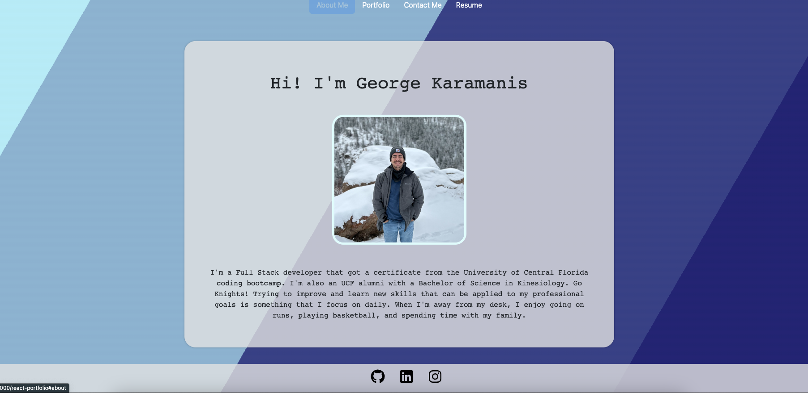

# React Portfolio

## Table of Contents

- [Description](#description)
- [Installation](#installation)
- [Usage](#usage)
- [Questions](#questions)

## Description
This application is a portfolio about me and my projects. There is also a contact page where you will be able to get in touch with me if there are any questions or concerns. I will also have resume page where you will be able to download my current resume and see a list of a few of my skills! 

## Installation
Created a react application by running `npx create-react-app react-portfolio`

## Usage
When loading the portfolio, you are presented with the "About Me" page. There are three other tabs at the top of the page to navigate throughout the portfolio. In the Portfolio section, there is a list of my projects, which can be viewed at their live site or github repository. The Contact page will prompt you with entries so you can contact me. Lastly the Resume Page will list a few of my skills while also having the option of downloading my resume by clicking on the "Download Resume" link. The footer component can take you to my Github, LinkedIn, or Instagram depending on which one you click.

## Questions
If you have any questions please contact me at [gkaramanis@knights.ucf.edu](mailto:gkaramanis@knights.ucf.edu)